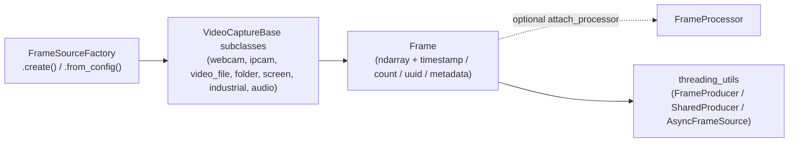

# FrameSource 📷🖼️

[](https://github.com/olkham/FrameSource/actions/workflows/ci.yml)
[](https://pypi.org/project/framesource/)
[](https://pypi.org/project/framesource/)

FrameSource is a flexible, extensible Python framework for acquiring frames from a wide variety of sources such as webcams, industrial cameras, IP cameras, video files, and even folders of images—using a unified interface. It was created to support my many projects that require switching between different frame providers without changing the downstream frame processing code.

> **Note:** This project was mostly written with the help of GitHub Copilot 🤖, making development fast, fun, and consistent! Even this README was largely generated by Copilot.

## Supported Sources

### Camera Sources
- 🖥️ **Webcam** (OpenCV) - Standard USB webcams, built-in laptop cameras
- 🌐 **IP Camera** (RTSP/HTTP) - Network cameras, security cameras
- 🏭 **Industrial Cameras**:
  - **Basler** cameras (via pypylon SDK) - High-performance industrial imaging
  - **Ximea** cameras - Scientific and machine vision cameras
  - **Huateng** cameras - Cost-effective industrial cameras
- 🔍 **Intel RealSense** - RGB-D cameras with depth sensing (tested with D456)

### Media Sources  
- 🎥 **Video File** (MP4, AVI, etc.) - Playback with looping and controls
- 🗂️ **Folder of Images** - Sorted by name or creation time with configurable FPS
- 🖼️ **Screen Capture** - Live region capture from desktop
- 🎵 **Audio Spectrogram** - Real-time audio visualization from microphone or files

## Demo


### Interactive 360° Camera Demo


The 360° camera example (`examples/camera_360_example.py`) provides an intuitive interface for exploring equirectangular footage:
- **Click & Drag**: Click anywhere on the 360° image and drag to smoothly pan the view
- **Mouse Wheel**: Scroll to zoom in/out by adjusting the field of view
- **Keyboard Controls**: Fine-tune pitch, yaw, roll, and FOV with precise keyboard shortcuts
- **Real-time Processing**: Live conversion from equirectangular to pinhole projection

## Why FrameSource?

When I work on computer vision, robotics, or video analytics projects, I often need to swap between different sources of frames: a webcam for quick tests, a folder of images for batch processing, a video file for reproducibility, or a specialized camera for deployment. FrameSource lets me do this with minimal code changes—just swap the provider!

## Why not plain OpenCV?

`cv2.VideoCapture` is great, but it only covers webcams, video files, and a handful of streams. The moment you need a Basler/Ximea industrial camera, a RealSense depth stream, a folder of images replayed at a fixed FPS, screen capture, or an audio spectrogram, you end up writing a different integration for each — with different connect/read/release semantics.

FrameSource is a thin **adapter layer** that gives every one of those sources the same `connect()` / `read()` / `disconnect()` contract (and an OpenCV-compatible `isOpened()` / `read()` surface), so your downstream processing code never has to care where frames come from. You opt into the heavier backends only when you install the matching extra.

## Design Goals

- **One interface, many sources** — identical `connect()`/`read()`/`disconnect()` contract across every backend, validated by a runtime-checkable `FrameSourceProtocol`.
- **Synchronous and predictable** — `read()` is a plain blocking call. No hidden background threads, no shared mutable frame buffers inside the capture objects.
- **Bring-your-own concurrency** — when you want threading or multiprocessing, opt in explicitly with the helpers in `framesource.threading_utils` so the threading model stays visible and under your control.

## Non-Goals

- **Frame-accurate multi-source synchronization** — FrameSource does not hardware-sync or timestamp-align multiple cameras for you.
- **High-throughput zero-copy pipelines** — it favours a simple, readable API over squeezing out maximum FPS or avoiding every copy.
- **GPU-first decoding** — decoding uses the backend's defaults (mostly CPU/OpenCV); it is not a CUDA/NVDEC acceleration layer.

## Architecture



## Features ✨

- Unified interface for all frame sources (cameras, video files, image folders, screen capture, audio spectrograms)
- Built-in frame processors for specialized transformations (360° equirectangular to pinhole projection)
- Easily extensible with new capture types and processing modules
- Optional external threading/multiprocessing helpers (`framesource.threading_utils`) for smooth, decoupled frame acquisition
- Control over exposure, gain, resolution, FPS (where supported by the source)
- Real-time playback and looping for video and image folders
- Simple factory pattern for instantiating sources

## Installation

### Install from PyPI

```sh
pip install framesource
```

With optional extras:

```sh
# Audio spectrogram support
pip install "framesource[audio]"

# Basler camera support
pip install "framesource[basler]"

# RealSense camera support
pip install "framesource[realsense]"

# GenICam (Harvester) support
pip install "framesource[genicam]"

# Everything with a PyPI-installable dependency
pip install "framesource[full]"

# Multiple extras at once
pip install "framesource[audio,basler,realsense]"
```

> **Note on vendor SDK cameras:** Ximea and Huateng/MindVision backends ship with
> the package but rely on proprietary drivers that are **not** available on PyPI.
> Install the vendor SDK separately (Ximea `xiapi`, or the Huateng/MindVision
> camera drivers) and the corresponding backend will activate automatically.
>
> The 360°/fisheye processors only require the core dependencies (`numpy`,
> `opencv-python`) and work out of the box — no extra needed.

### Install Directly from GitHub

You can install FrameSource directly from GitHub without cloning:

```sh
# Latest version from main branch
pip install git+https://github.com/olkham/FrameSource.git

# Specific branch
pip install git+https://github.com/olkham/FrameSource.git@branch-name

# Specific tag or commit
pip install git+https://github.com/olkham/FrameSource.git@v1.0.0
```

### Install from Local Clone

Clone the repository and install with pip:

```sh
git clone https://github.com/olkham/FrameSource.git
cd FrameSource
pip install .
```

Or for development (editable) install:

```sh
pip install -e .
```

### Installation Options


FrameSource supports optional dependencies for additional features:

**From GitHub:**
```sh
# Basic installation (core frame sources only)
pip install git+https://github.com/olkham/FrameSource.git

# With audio spectrogram support
pip install "framesource[audio] @ git+https://github.com/olkham/FrameSource.git"

# With Basler camera support
pip install "framesource[basler] @ git+https://github.com/olkham/FrameSource.git"

# With RealSense camera support
pip install "framesource[realsense] @ git+https://github.com/olkham/FrameSource.git"

# With GenICam (Harvester) support
pip install "framesource[genicam] @ git+https://github.com/olkham/FrameSource.git"

# With all optional features
pip install "framesource[full] @ git+https://github.com/olkham/FrameSource.git"

# Multiple extras at once
pip install "framesource[audio,basler,realsense] @ git+https://github.com/olkham/FrameSource.git"
```

**From local installation:**
```sh
# Basic installation (core frame sources only)
pip install .

# With audio spectrogram support
pip install .[audio]

# With Basler camera support
pip install .[basler]

# With RealSense camera support
pip install .[realsense]

# With all optional features
pip install .[full]

# Multiple extras at once
pip install .[audio,basler,realsense]
```

### Manual Dependency Installation

Alternatively, you can install dependencies manually:

```sh
# Audio processing
pip install librosa soundfile pyaudio

# Basler cameras
pip install pypylon

# RealSense cameras
pip install pyrealsense2
```

## Example Usage

> 💡 **Tip**: For comprehensive examples of each capture type, see the `examples/` directory. Run `python examples/run_examples.py` for an interactive demo menu.

### 1. Using the Factory


```python
from framesource import FrameSourceFactory

# Webcam — create() connects automatically by default; pass connect=False
# if you need to configure the source before connecting yourself.
cap = FrameSourceFactory.create('webcam', source_id=0, connect=False)
cap.connect()
ret, frame = cap.read()
cap.disconnect()


# Video file (see demo in media/demo.mp4) — auto-connects, no explicit connect() needed
cap = FrameSourceFactory.create('video_file', source_id='media/demo.mp4', loop=True)
while cap.is_connected:
    ret, frame = cap.read()
    if not ret:
        break
cap.disconnect()

# Folder of images — auto-connects, no explicit connect() needed
cap = FrameSourceFactory.create('folder', source_id='media/image_seq', sort_by='date', fps=10, loop=True)
while cap.is_connected:
    ret, frame = cap.read()
    if not ret:
        break
cap.disconnect()
```

Sources are also iterable — the loop above can be written as:

```python
with FrameSourceFactory.create('video_file', source_id='media/demo.mp4', connect=False) as cap:
    for frame in cap:           # yields Frame objects until the source is exhausted
        process(frame)
```

Each `frame` is a `Frame` — a `numpy.ndarray` subclass that works in any
OpenCV/numpy call and carries `timestamp` (wall clock), `monotonic` (for
latency/FPS math), `count`, `uuid`, `source`, and a free-form `metadata` dict.

### 2. Config-Driven Creation

Sources can also be built from a plain `dict`, or from a `.json`/`.yaml` file, via
`FrameSourceFactory.from_config()`. This is handy for storing camera configs alongside
your application config instead of hand-writing `create()` calls.

```python
from framesource import FrameSourceFactory

# From a dict
cap = FrameSourceFactory.from_config({
    "source_type": "webcam",
    "source_id": 0,
    "connect": False,   # extra keys pass straight through as create() kwargs
})
cap.connect()

# From a file (JSON or YAML — YAML requires PyYAML installed)
cap = FrameSourceFactory.from_config("configs/webcam.yaml")
```

The config shape mirrors `create()`'s parameters: `source_type` and `source_id` are read
directly, and any other keys (e.g. `fps`, `loop`, `connect`) are forwarded as keyword
arguments.

#### Webcam frame rate at high resolution (MJPG / backend)

If a USB webcam requests 1080p (or higher) at 30 fps but only delivers a handful of frames
per second, the cause is almost always the **pixel format**: the camera is streaming an
**uncompressed** format (e.g. YUY2) that saturates the USB link, where the Windows Camera app
would request compressed **MJPG**. Two knobs fix this:

```python
cap = FrameSourceFactory.create(
    'webcam', source_id=0,
    width=1920, height=1080, fps=30,
    fourcc='MJPG',      # request a compressed format (applied before the resolution)
    backend='msmf',     # on Windows, MSMF negotiates MJPG where DirectShow often won't
)
```

- **`fourcc`** — four-character pixel format, e.g. `'MJPG'`. Applied before the resolution so
  the driver doesn't reset it.
- **`backend`** — `'msmf'`, `'dshow'`, `'v4l2'`, `'avfoundation'`, `'gstreamer'`, `'ffmpeg'`,
  `'any'`, or a raw `cv2.CAP_*` int. Defaults to the OS default (DirectShow on Windows). Note
  that DirectShow and MSMF interpret `set_exposure()`/`set_gain()` values differently.

`connect()` logs a warning if it detects an uncompressed format negotiated at 720p or above, so
this failure mode is visible rather than silent.

### 3. Direct Use

#### Intel RealSense Camera
```python
from framesource.sources.realsense_capture import RealsenseCapture
from framesource.processors import RealsenseDepthProcessor
from framesource.processors.realsense_depth_processor import RealsenseProcessingOutput

# Tested with Intel RealSense D456 camera
cap = RealsenseCapture(width=640, height=480)
processor = RealsenseDepthProcessor(output_format=RealsenseProcessingOutput.ALIGNED_SIDE_BY_SIDE)
cap.attach_processor(processor)
cap.connect()
while cap.is_connected:
    ret, frame = cap.read()
    if not ret:
        break
    # Frame contains RGB and depth side-by-side or other configured format
cap.disconnect()
```

#### Folder of Images
```python
from framesource.sources.folder_capture import FolderCapture
cap = FolderCapture('media/image_seq', sort_by='name', width=640, height=480, fps=15, real_time=True, loop=True)
cap.connect()
while cap.is_connected:
    ret, frame = cap.read()
    if not ret:
        break
cap.disconnect()
```

#### Screen Capture
```python
from framesource.sources.screen_capture import ScreenCapture
cap = ScreenCapture(x=100, y=100, w=800, h=600, fps=30)
cap.connect()
while cap.is_connected:
    ret, frame = cap.read()
    if not ret:
        break
    # process or display frame
cap.disconnect()
```

#### Audio Spectrogram Capture
```python
# Audio spectrogram from microphone (real-time) — auto-connects, no explicit connect() needed
cap = FrameSourceFactory.create('audio_spectrogram', 
                              source_id=None,  # None = default microphone
                              n_mels=128, 
                              window_duration=2.0,
                              freq_range=(20, 8000),
                              colormap=cv2.COLORMAP_VIRIDIS)
while cap.is_connected:
    ret, frame = cap.read()
    if not ret:
        break
    # frame is now a visual spectrogram that can be processed like any other image
cap.disconnect()

# Audio spectrogram from file
cap = FrameSourceFactory.create('audio_spectrogram', 
                              source_id='path/to/audio.wav',
                              n_mels=64,
                              frame_rate=30)
while cap.is_connected:
    ret, frame = cap.read()
    if not ret:
        break
cap.disconnect()
```

## Concurrency (External Threading) 🧵

Capture objects are **synchronous**: `read()` blocks until the next frame is ready and the source never spins up hidden background threads. When you want to decouple frame acquisition from processing, you opt in explicitly with the helpers in `framesource.threading_utils`. This keeps the threading model visible and under your control.

### Quickest: a producer thread feeding a queue

```python
import queue, threading
from framesource import FrameSourceFactory
from framesource.threading_utils import simple_frame_producer

camera = FrameSourceFactory.create('webcam', source_id=0)  # auto-connects

frame_queue = queue.Queue(maxsize=10)
stop_event = threading.Event()

producer = threading.Thread(
    target=simple_frame_producer,
    args=(camera, frame_queue, stop_event, 30),  # target 30 FPS
    daemon=True,
)
producer.start()

try:
    while True:
        ret, frame = frame_queue.get(timeout=1.0)
        if not ret:
            continue
        # ... process / display frame ...
finally:
    stop_event.set()
    producer.join(timeout=2)
    camera.disconnect()
```

### Managed: `FrameProducer` with built-in stats

```python
from framesource import FrameSourceFactory
from framesource.threading_utils import FrameProducer

camera = FrameSourceFactory.create('webcam', source_id=0)  # auto-connects

producer = FrameProducer(camera, max_queue_size=10, target_fps=30)
producer.start()

try:
    while True:
        ret, frame = producer.get_frame(timeout=1.0)
        if not ret:
            continue
        # ... process / display frame ...
finally:
    producer.stop()
    print(producer.get_stats())  # frames_captured, frames_dropped, fps, avg_latency, ...
    camera.disconnect()
```

### Heavier workloads: multiprocessing

For CPU-bound consumers you can move acquisition into a separate process. `multiprocess_frame_producer` takes a plain source-config dict and builds the capture inside the child process:

```python
import multiprocessing as mp
from framesource.threading_utils import multiprocess_frame_producer

source_config = {'source_type': 'webcam', 'source_id': 0}
frame_queue = mp.Queue(maxsize=10)
stop_event = mp.Event()

worker = mp.Process(
    target=multiprocess_frame_producer,
    args=(source_config, frame_queue, stop_event),
    daemon=True,
)
worker.start()

try:
    while True:
        ret, frame = frame_queue.get(timeout=1.0)
        if not ret:
            continue
        # ... process frame ...
finally:
    stop_event.set()
    worker.join(timeout=2)
```

### Sharing one camera between consumers: `SharedProducer`

A physical camera can only be opened once, but a UI preview, a recorder, and a
network stream may all want its frames. `SharedProducer` is the explicit way to
fan one source out to many consumers — one visible producer thread, one queue
per subscriber, no hidden global state:

```python
from framesource import FrameSourceFactory, SharedProducer

camera = FrameSourceFactory.create('webcam', source_id=0, connect=False)

producer = SharedProducer(camera, target_fps=30)
ui_queue = producer.subscribe(maxsize=5)        # subscribe before or after start()
recorder_queue = producer.subscribe(maxsize=30)
producer.start()                                 # connects the source if needed

# ... each consumer drains its own queue at its own pace ...
ret, frame = ui_queue.get(timeout=1.0)

producer.stop()          # stops the producer thread
camera.disconnect()      # you own the source lifecycle
```

### asyncio: `AsyncFrameSource`

For async applications, wrap any source in `AsyncFrameSource` — reads are
offloaded to a dedicated single worker thread so the event loop never blocks,
and the capture core stays fully synchronous:

```python
import asyncio
from framesource import FrameSourceFactory, AsyncFrameSource

async def main():
    camera = FrameSourceFactory.create('webcam', source_id=0, connect=False)
    async with AsyncFrameSource(camera) as source:
        for _ in range(100):
            ret, frame = await source.read()

asyncio.run(main())
```

### Waiting for a stream to become ready

Network sources (RTSP/HTTP) can report "connected" before they actually
deliver frames. `wait_until_ready()` polls until the first frame arrives:

```python
cap = FrameSourceFactory.create('ipcam', source_id='rtsp://...', connect=True)
if not cap.wait_until_ready(timeout=10.0):
    raise RuntimeError("stream connected but produced no frames")
```

> See `examples/threading_utils_examples.py` and `examples/multiple_cameras_external_threading.py` for complete runnable demos.

## Frame Processors 🔄

FrameSource includes powerful frame processors for specialized transformations:

### Equirectangular 360° to Pinhole Projection

Convert 360° equirectangular footage to normal pinhole camera views with interactive controls:

```python
from framesource import FrameSourceFactory
from framesource.processors.equirectangular360_processor import Equirectangular2PinholeProcessor

# Load 360° video or connect to 360° webcam — auto-connects, no explicit connect() needed
cap = FrameSourceFactory.create('video_file', source_id='360_video.mp4')
# Or for live 360° camera: cap = FrameSourceFactory.create('webcam', source_id=0)

# Create processor for 90° FOV pinhole view
processor = Equirectangular2PinholeProcessor(fov=90.0, output_width=1920, output_height=1080)

# Set viewing angles (in degrees)
processor.set_parameter('yaw', 45.0)    # Look right
processor.set_parameter('pitch', 0.0)   # Look straight ahead
processor.set_parameter('roll', 0.0)    # No rotation

# Attach processor to the frame source for automatic processing
cap.attach_processor(processor)

while cap.is_connected:
    ret, frame = cap.read()  # Frame is automatically processed by attached processor
    if not ret:
        break
    
    # The frame is now the processed pinhole projection
    cv2.imshow('360° to Pinhole', frame)
    if cv2.waitKey(1) & 0xFF == ord('q'):
        break

cap.disconnect()
```

> 💡 **Interactive Demo**: Try `python examples/camera_360_example.py` for a fully interactive 360° viewer with mouse controls! Click and drag on the equirectangular image to look around, use the mouse wheel to zoom, and keyboard shortcuts for fine adjustments.

You can also manually process frames without attaching:

```python
# Manual processing (without attach)
while cap.is_connected:
    ret, frame = cap.read()
    if not ret:
        break
    
    # Manually process the frame
    pinhole_frame = processor.process(frame)
    cv2.imshow('360° to Pinhole', pinhole_frame)
    if cv2.waitKey(1) & 0xFF == ord('q'):
        break
```

### Creating Custom Frame Processors

Extend the `FrameProcessor` base class for your own transformations:

```python
from framesource.processors.frame_processor import FrameProcessor
import cv2

class GrayscaleProcessor(FrameProcessor):
    def process(self, frame):
        return cv2.cvtColor(frame, cv2.COLOR_BGR2GRAY)

# Use your custom processor
processor = GrayscaleProcessor()

# Option 1: Attach to frame source for automatic processing
cap = FrameSourceFactory.create('webcam', source_id=0)  # auto-connects
cap.attach_processor(processor)

while cap.is_connected:
    ret, frame = cap.read()  # Frame is automatically converted to grayscale
    if not ret:
        break
    cv2.imshow('Grayscale', frame)
    if cv2.waitKey(1) & 0xFF == ord('q'):
        break

# Option 2: Manual processing
processed_frame = processor.process(original_frame)
```

## Extending FrameSource

### Adding New Frame Sources

Want to add a new camera or source? Just subclass `VideoCaptureBase` and register it:

```python
from framesource import FrameSourceFactory
FrameSourceFactory.register_capture_type('my_camera', MyCameraCapture)
```

You don't have to inherit from `VideoCaptureBase` to work with the concurrency
helpers, though. Anything that structurally satisfies `FrameSourceProtocol`
(`connect()`, `disconnect()`, `read()`, `is_open()`) is accepted by
`simple_frame_producer`, `FrameProducer`, `SharedProducer`, and
`AsyncFrameSource` — the protocol is `runtime_checkable`, so
`isinstance(obj, FrameSourceProtocol)` also works:

```python
from framesource import FrameSourceProtocol

def run(source: FrameSourceProtocol) -> None:
    source.connect()
    ret, frame = source.read()
    ...
```

### Error handling

`read()` keeps the OpenCV-style `(ret, frame)` contract — it never raises for
an ordinary failed read. Structured exceptions (all subclasses of
`framesource.FrameSourceError`) are raised only for setup problems, and they
multiple-inherit from the builtin you would already be catching:

- `MissingDependencyError` (also an `ImportError`) — an optional SDK/extra is
  not installed; the message names the exact `pip install framesource[extra]`.
- `UnknownSourceTypeError` (also a `ValueError`) — unknown factory source type.

### Adding New Frame Processors

Create custom frame processors by extending `FrameProcessor`:

```python
from framesource.processors.frame_processor import FrameProcessor

class MyCustomProcessor(FrameProcessor):
    def __init__(self, custom_param=1.0):
        super().__init__()
        self.set_parameter('custom_param', custom_param)
    
    def process(self, frame):
        # Your custom processing logic here
        custom_param = self.get_parameter('custom_param')
        # ... apply transformation ...
        return processed_frame
```

## Roadmap

Planned for after this release (see `.github/prompts/future.md` for full briefs):

- **Auto-reconnect wrapper** (`ReconnectingSource`) for flaky RTSP/IP camera sources — opt-in,
  handles backoff and reconnection without hiding it inside the capture classes.
- **Plugin packages** for vendor SDKs (Ximea, Huateng) and new sources (NDI, picamera2),
  discovered via Python entry points instead of editing the factory directly.
- **`FrameSink` write/record API** — `VideoFileSink`/`FolderSink`/`DisplaySink` mirroring the
  source contract, with metadata round-trip (a `FolderCapture` can read back the sidecar
  metadata a `FolderSink` wrote).
- **Pipeline abstraction** — a small `source → processors → sink` runner built on top of the
  sinks and reconnect work above.
- **PyAV backend selection** for decode, with optional hardware decode — an opt-in `backend=`
  kwarg alongside the OpenCV default, for accurate PTS timestamps and RTSP transport control.

## Credits

- Written by me, with lots of help from GitHub Copilot 🤖
- OpenCV and other camera SDKs for backend support
- public RTSP URL from https://github.com/grigory-lobkov/rtsp-camera-view/issues/3


---

Happy frame grabbing! 🚀
